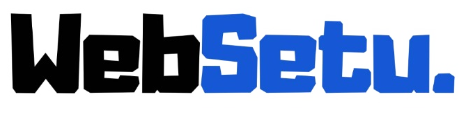

# 🌉 WebDari — Your Bridge to a Stronger Online Presence

<div align="center">

  

  <p align="center">
    <strong>Full-Service Digital Growth Agency for Modern & Scaling Businesses.</strong>
  </p>

  <p align="center">
    <a href="https://websetu.vercel.app"><strong>Explore Live Website »</strong></a>
  </p>

  <p align="center">
    
    
    
    
    
  </p>

</div>

---

## 📖 About WebDari

**WebDari (वेब-दारी)** is a modern digital agency engineered to bridge the gap between traditional businesses and online dominance. We empower solo entrepreneurs, clinics, high-ticket service providers, and D2C brands with custom web architectures, high-ROAS UGC video ads, and full-funnel social media management.

> *"You know the business. We know the digital world. Let's bridge the gap."*

---

## ✨ Key Offerings & Services

### 1. 💻 [Website Creation](https://websetu.vercel.app/services/website-creation)
* **Custom UI/UX Architecture**: Bespoke, mobile-first layouts designed to build instant authority and trust.
* **Sub-Second Speed & Global CDN**: Lightning-fast cloud hosting powered by edge networks with automatic Free SSL.
* **Conversion Engines**: Direct 1-click WhatsApp lead integration, automated strategy booking calendars, and Google Maps SEO indexing.
* **Tiers**:
  * `Starter Landing Page` (6–7 Days Turnaround • 1 Month Free Technical Support)
  * `Business Growth Bridge` (10–12 Days Turnaround • Up to 5 Pages • SEO & WhatsApp Engine)
  * `Enterprise Custom Ecosystem` (2–3 Weeks • Dynamic CMS • Payment Gateways • VIP Support)

### 2. 🎬 [UGC Video Content](https://websetu.vercel.app/services/ugc-content)
* **Short-Form Video Ads**: High-retention 9:16 vertical video assets crafted specifically for Meta Ads, Instagram Reels, and YouTube Shorts.
* **Hook-Based Scripting**: Proven problem-agitate-solve formulas with dynamic animated captions.
* **Tiers**:
  * `Creator Kickstart Pack` (4 Custom UGC Videos • Commercial Usage Rights)
  * `Viral Ad Arsenal` (7–8 High-Converting UGC Assets • Raw Footage Delivery)
  * `Omnichannel Dominance` (15–20 Monthly Videos • Dedicated Creative Strategist)

### 3. 📱 [Social Media Handling](https://websetu.vercel.app/services/social-media-handling)
* **End-to-End Execution**: Monthly strategic content calendars, graphic design, caption copywriting, and hashtag research.
* **Daily Inbound Community Management**: Active DM & comment handling (All 7 Days) to nurture leads into booked appointments.
* **Tiers**:
  * `Foundation Authority Plan` (12 Posts & Carousels / month • 1 Primary Platform)
  * `Full Brand Acceleration` (20 Premium Assets / month • Daily Stories • All 7 Days DM Handling)
  * `Omnichannel Monopoly` (30 Daily Fresh Posts, Viral Reels & Stories • Lead Team • Multi-Platform)

---

## 🛠️ Tech Stack & Libraries

* **Framework**: [React 18](https://react.dev/) + [Vite](https://vitejs.dev/)
* **Styling**: [Tailwind CSS](https://tailwindcss.com/)
* **Animations**: [Framer Motion](https://www.framer.com/motion/)
* **Icons**: [Lucide React](https://lucide.dev/)
* **Routing**: [React Router v6](https://reactrouter.com/)
* **Hosting**: [Vercel](https://vercel.com/) (Edge Network CDN + Automated SSL)

---

## 🚀 Getting Started Locally

### Prerequisites
* [Node.js](https://nodejs.org/) (version 18.0.0 or higher)
* [npm](https://www.npmjs.com/) or [yarn](https://yarnpkg.com/)

### Installation

1. **Clone the repository:**
   ```bash
   git clone https://github.com/YOUR_USERNAME/webdari.git
   cd webdari
   ```

2. **Install dependencies:**
   ```bash
   npm install
   ```

3. **Start the development server:**
   ```bash
   npm run dev
   ```
   Open [http://localhost:5173](http://localhost:5173) in your browser to view the application.

4. **Build for production:**
   ```bash
   npm run build
   ```

---

## 🌐 Deployment

The project is pre-configured for sub-second deployment on **Vercel**:

```bash
npx vercel --prod
```

---

## 📞 Connect with WebDari

* 🌐 **Live Website**: [websetu.vercel.app](https://websetu.vercel.app)
* 📸 **Instagram**: [@websetu.official](https://www.instagram.com/websetu.official)
* 💼 **LinkedIn**: [WebDari Connections](https://www.linkedin.com/in/websetu-connections-b88579432/?skipRedirect=true)
* 💬 **WhatsApp Line 1**: [+91 83778 66258](https://wa.me/918377866258)
* 💬 **WhatsApp Line 2**: [+91 88513 47754](https://wa.me/918851347754)
* ✉️ **Email**: `websetu.mail@gmail.com`

---

<div align="center">
  <small>© 2026 WebDari. All rights reserved.</small>
</div>
